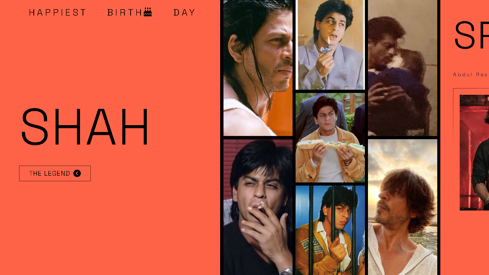
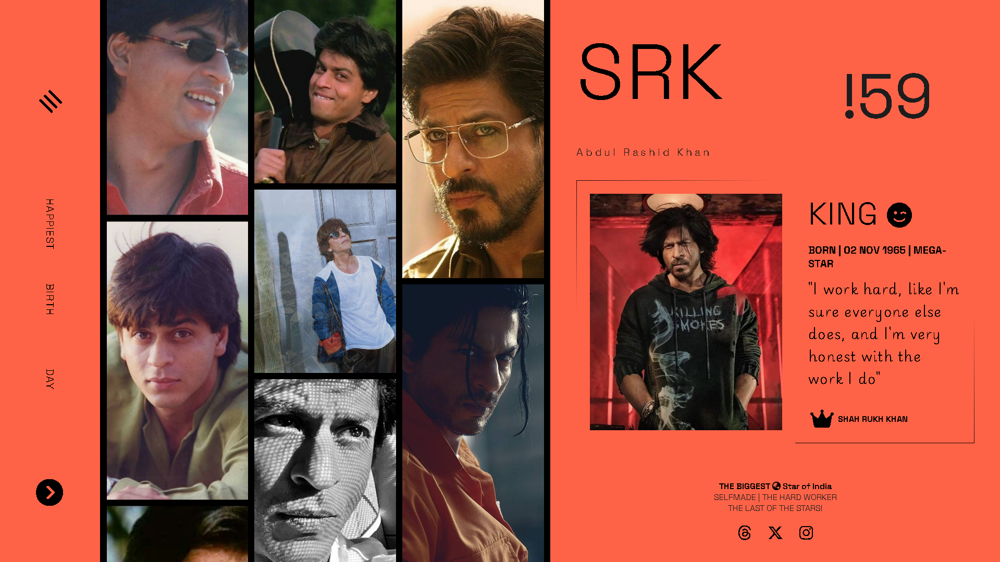

# Shah Rukh Khan Birthday Wishes Page 🎂

A special project dedicated to celebrating Shah Rukh Khan's birthday, featuring a simple yet elegant gallery of his memorable moments.

## 📸 Sample Preview

## 🎨 Features
- **Minimalist Design**: Clean and vibrant layout for a delightful experience.
- **Image Gallery**: A small selection of iconic images of SRK.
- **Responsive Layout**: Adapts seamlessly to different screen sizes.
- **JavaScript Integration**: Fetches and displays images dynamically.

## 🛠️ Tech Stack
- **HTML**: For structure.
- **CSS**: For styling and layout.
- **JavaScript**: For interactivity.

## 🚀 Live Preview
Celebrate with us: [Shah Rukh Khan Birthday Wishes Page](https://ash-dot-coder.github.io/srkTheKing/Shah-Day/srk.html#)

## 📂 Repository
Explore the code on GitHub: [srkTheKing Repository](https://github.com/Ash-dot-coder/srkTheKing/tree/theKing/Shah-Day)

---

**Happy Birth-Day: 🎂 The Shah Rukh Khan | King | Baadshaah | Self Made: The Hard Worker | The last of the Stars!**